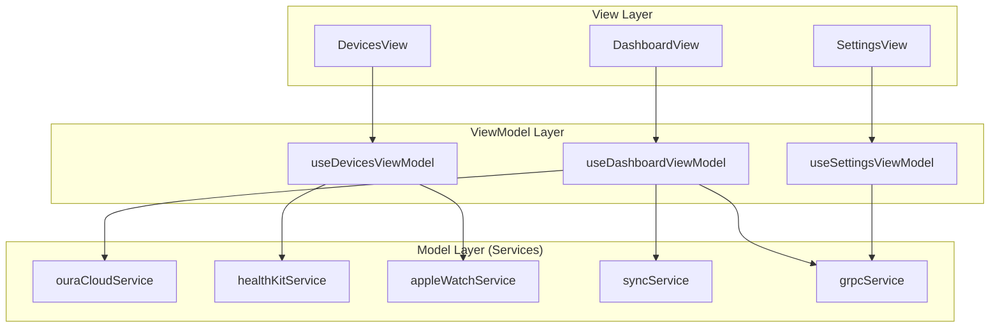

# Mobile Documentation

## Overview

AIDOC Mobile is a React Native / Expo application with **MVVM architecture** and offline-first design.

## Tech Stack

| Component | Technology |
|-----------|------------|
| Framework | React Native + Expo SDK 54 |
| Language | TypeScript |
| Architecture | MVVM (Model-View-ViewModel) |
| State | React Hooks + ViewModels |
| API | gRPC / GraphQL + SSE |
| BLE | react-native-ble-plx |
| Health | Apple HealthKit |
| Storage | AsyncStorage |

## MVVM Architecture



## Project Structure

```
mobile/
├── App.tsx                      # App shell + navigation
├── src/
│   ├── views/                   # View components (UI only)
│   │   ├── DashboardView.tsx
│   │   ├── DevicesView.tsx
│   │   ├── SettingsView.tsx
│   │   └── index.ts
│   ├── viewmodels/              # ViewModel hooks (state + logic)
│   │   ├── DashboardViewModel.ts
│   │   ├── DevicesViewModel.ts
│   │   ├── SettingsViewModel.ts
│   │   ├── __tests__/
│   │   └── index.ts
│   ├── services/                # Model layer (data access)
│   │   ├── oura-cloud.service.ts
│   │   ├── oura-ble.adapter.ts
│   │   ├── healthkit.service.ts
│   │   ├── apple-watch.service.ts
│   │   ├── grpc.service.ts
│   │   ├── sync.service.ts
│   │   ├── ble.service.ts
│   │   ├── __tests__/
│   │   └── index.ts
│   ├── config/
│   │   └── api.config.ts
│   └── __mocks__/               # Test mocks
├── jest.config.js
└── package.json
```

## Data Sources

| Source | Method | Status |
|--------|--------|--------|
| Oura Ring | Cloud API (OAuth2/PAT) | ✅ Implemented |
| Oura Ring | BLE Direct | ⚠️ Research (encryption) |
| Apple Watch | HealthKit | ✅ Implemented |
| Apple HealthKit | Direct | ✅ Implemented |

## Oura Ring Integration

### Cloud API (Recommended)
```typescript
// Uses OURA_ACCESS_TOKEN from backend .env
const data = await ouraCloudService.fetchData();
// Returns: sleep, activity, readiness data
```

### BLE Direct (Privacy-First)
> ⚠️ Oura BLE protocol is encrypted. Requires reverse engineering.

```typescript
// Before scanning: unpair from official Oura app
await ouraBleAdapter.initialize();
await ouraBleAdapter.scan((device) => console.log(device));
await ouraBleAdapter.connect(deviceId);
```

## Testing

```bash
cd mobile
npm test
```

| Test Suite | Tests | Coverage |
|------------|-------|----------|
| Services | 22 | oura, healthkit, watch, sync |
| ViewModels | 19 | dashboard, devices, settings |
| **Total** | **41** | All passing ✅ |

## ViewModel Usage

```typescript
// View component uses ViewModel hook
import { useDashboardViewModel } from '../viewmodels';

export const DashboardView: React.FC = () => {
  const [state, actions] = useDashboardViewModel();
  
  return (
    <Button onPress={actions.loadData}>
      {state.isLoadingData ? 'Loading...' : 'Refresh'}
    </Button>
  );
};
```

## Development

```bash
# Install dependencies
cd mobile
npm install --legacy-peer-deps

# Start Expo
npx expo start

# Run tests
npm test

# Build development client (for BLE)
npx eas build --profile development --platform ios
```

## Environment Variables

Configure in `mobile/.env` or `EXPO_PUBLIC_*`:

| Variable | Description | Default |
|----------|-------------|---------|
| `EXPO_PUBLIC_API_URL` | Backend URL | Auto-detect |
| `EXPO_PUBLIC_GRPC_HOST` | gRPC host | localhost |
| `EXPO_PUBLIC_GRPC_PORT` | gRPC port | 50051 |
