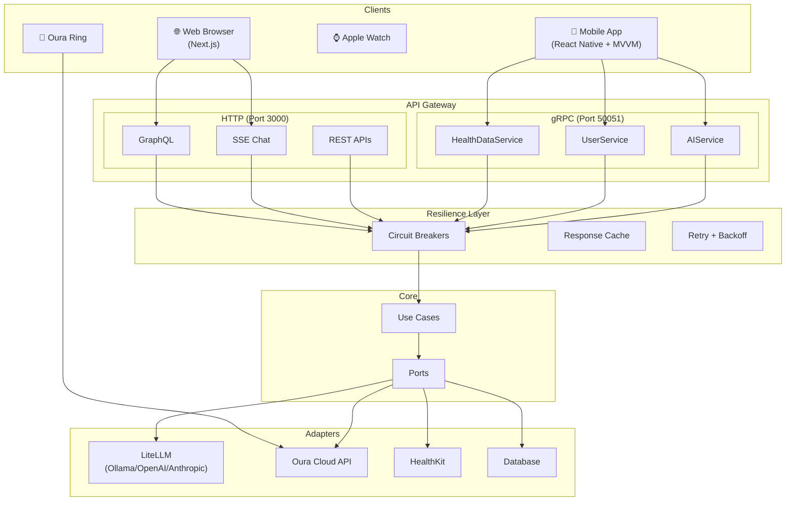
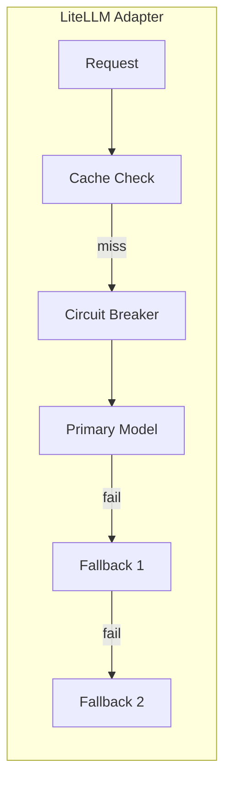

# AIDOC Architecture

## Overview

AIDOC uses **Hexagonal Architecture** (Ports & Adapters) with:
- **MVVM** pattern for mobile
- **Multi-Protocol API** (GraphQL, gRPC, SSE)
- **Resilience Patterns** (Circuit Breakers, Fallbacks, Caching)

## High-Level Architecture



## Resilience Patterns

### Circuit Breaker States
```
CLOSED ──(failures > threshold)──▶ OPEN ──(timeout)──▶ HALF_OPEN
   ▲                                                        │
   └────────────────(successes > threshold)─────────────────┘
```

### Pre-configured Breakers
| Service | Threshold | Reset | Timeout |
|---------|-----------|-------|---------|
| AI (LiteLLM) | 3 failures | 60s | 30s |
| Oura API | 5 failures | 30s | 10s |
| HealthKit | 3 failures | 15s | 5s |
| Database | 3 failures | 10s | 5s |

## Directory Structure

```
ai-health-tracker/
├── app/api/                    # Next.js API Routes
│   ├── graphql/route.ts
│   ├── chat/route.ts           # SSE streaming
│   ├── health/
│   │   ├── route.ts            # Basic health
│   │   └── status/route.ts     # Detailed + circuit breakers
│   └── oura/
│       ├── route.ts            # Oura data
│       ├── connect/route.ts    # OAuth start
│       └── callback/route.ts   # OAuth callback
│
├── src/
│   ├── adapters/
│   │   ├── ai/
│   │   │   ├── ollama.adapter.ts
│   │   │   └── litellm.adapter.ts  # Multi-provider + fallbacks
│   │   ├── database/
│   │   │   └── memory.adapter.ts
│   │   ├── health/
│   │   │   ├── oura-cloud.adapter.ts
│   │   │   └── oura-oauth.ts
│   │   └── factory.ts
│   │
│   ├── ports/                  # Interfaces
│   │   ├── ai.port.ts
│   │   ├── database.port.ts
│   │   └── health-data.port.ts
│   │
│   ├── utils/                  # Resilience utilities
│   │   ├── circuit-breaker.ts
│   │   └── retry.ts
│   │
│   ├── graphql/
│   └── grpc/
│
├── mobile/                     # React Native (MVVM)
│   └── src/
│       ├── views/              # UI components
│       ├── viewmodels/         # State + logic
│       └── services/           # Data access
│
├── tests/                      # Test suites
│   ├── features/               # BDD tests
│   ├── frontend/               # Component tests
│   └── integration/            # API tests
│
└── docs/
```

## AI Provider Architecture (LiteLLM)



### Configuration
```env
AI_ADAPTER=litellm
LITELLM_PRIMARY_MODEL=ollama/llama3.2
LITELLM_FALLBACK_MODELS=openai/gpt-4o-mini,anthropic/claude-3-haiku
LITELLM_CACHE_ENABLED=true
```

## Mobile MVVM

| Layer | Files | Responsibility |
|-------|-------|----------------|
| View | `*View.tsx` | UI rendering only |
| ViewModel | `use*ViewModel.ts` | State, actions, side effects |
| Model | `*Service.ts` | Data access, API calls |

## Testing Strategy

| Layer | Tool | Tests |
|-------|------|-------|
| Backend Unit | Vitest | 124 |
| Mobile Unit | Jest | 41 |
| Feature/BDD | Vitest | 27 |
| Frontend | Vitest | 17 |
| **Total** | | **165+** |

## API Endpoints

| Endpoint | Method | Description |
|----------|--------|-------------|
| `/api/graphql` | POST | GraphQL queries |
| `/api/chat` | POST | SSE AI streaming |
| `/api/health` | GET | Basic health |
| `/api/health/status` | GET | Detailed + circuit breakers |
| `/api/oura` | GET | Oura health data |
| `/api/oura/connect` | GET | Start OAuth2 |
| `/api/oura/callback` | GET | OAuth2 callback |
